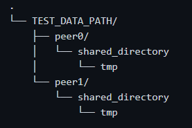
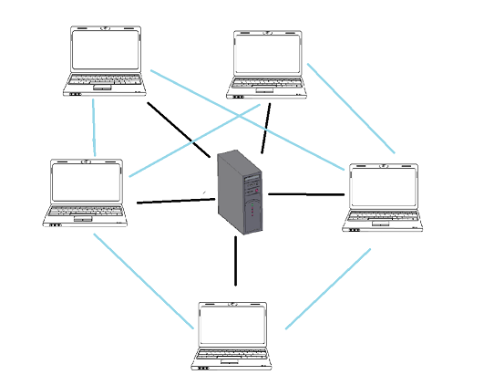

# Peer-to-Peer (P2P) Service 

<ins>Tracker</ins>
```console
java Tracker PATH_OF_LISTFILE
```
- PATH_OF_LISTFILE: The path of the file which contains all the files in the P2P system <br>
File Format: each line of the file contains the name of a file <br>
file's name is unique within the system and we use it as identifier


<ins>Peer</ins>
```console
java Tracker IP PORT USER_NAME PASSWORD PATH_OF_SHARED_DIRECTORY AUTO_MODE
```
- IP: PEER'S IP 
- PORT: PEER'S PORT
- USER_NAME: PEER'S USERNAME
- PASSWORD: PEER'S PASSWORD
- PATH_OF_SHARED_DIRECTORY: all files in this directory will be shared. You should also have a directory under this directory which should be called "tmp". This directory will be used to temporary save the file's parts.
- AUTO_MODE: {true, false} If we set auto-mode to false, a command line menu will be shown and we will download whatever file we want.
On the other hand, if we set auto-mode to true, the peer will try to download all system's files
*** 
#### Simulation

We simulate a system with 1 tracker and NUM_PEERS peers. At the end, all peers will have saved in their SHARED_DIRECTORY all system's files.

```console
java Simulation NUM_PEERS OUT_PATH PATH_OF_LISTFILE TEST_DATA_PATH 
```
- NUM_PEERS: the number of peers you want to create
- OUT_PATH: path that the class files are placed
- PATH_OF_LISTFILE: Tracker's input path
- TEST_DATA_PATH: this should be a directory under of which all peer's paths will be placed. Under this directory you should have NUM_PEERS directories with the following name pattern: each one of them should be called "peerX" where X = 0, 1, ..., NUM_PEERS. Under these directories the shared directory should be placed. <br>
For example, if we have 2 peers: <br>
   

***
#### Architecture:


*** 
This project was developed with Pair Programming technique.
